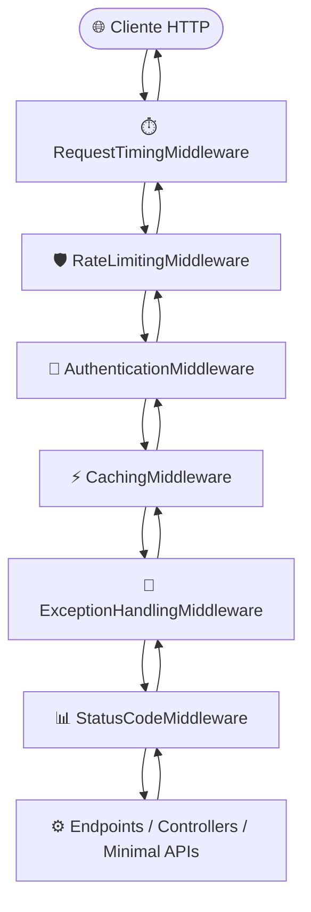

<p align="center">
  
</p>

# 🚀 TL.MiddlewareLibrary

[](https://dotnet.microsoft.com/)
[](https://www.nuget.org/profiles/ThaylonMALopes)
[](LICENSE.txt)

Bem-vindo ao ecossistema **TL.MiddlewareLibrary**! Esta biblioteca modular em C# / .NET disponibiliza middlewares de alta performance para enriquecer, monitorar e proteger o pipeline HTTP de aplicações corporativas em ASP.NET Core (.NET 6, .NET 8 e .NET 9).

Projetada para eliminar código repetitivo, ela centraliza medição de latência com zero alocação, proteção contra rajadas de requisições por IP, cache em memória seguro e padronização automática de erros em formato JSON amigável com rastreamento via `traceId`.

---

## 🎯 Por que Usar a Biblioteca?

Em muitas APIs, acabamos repetindo o mesmo código defensivo em todos os controllers e endpoints:
- Controladores cheios de blocos `try/catch` manuais.
- Cada endpoint ou microsserviço retornando erros em formatos diferentes (`{ erro }`, `{ message }`, `{ error_description }`), complicando a vida do front-end e mobile.
- Falhas 500 vazando stack traces ou mensagens técnicas de infraestrutura para o usuário.
- Falta de controle simples de requisições por cliente e medição precisa de tempo de resposta.

A **TL.MiddlewareLibrary** resolve isso direto no pipeline do ASP.NET Core, deixando seus controllers e Minimal APIs focados 100% nas regras de negócio.

---

### 💡 Antes vs. Depois

#### Antes (Sem a biblioteca — boilerplate e risco de vazamento)
```csharp
app.MapGet("/api/produtos/{id:int}", async (int id, IProdutoService service, ILogger<Program> logger) =>
{
    try
    {
        if (id <= 0)
            return Results.BadRequest(new { mensagem = "Id inválido" });

        var produto = await service.ObterPorIdAsync(id);
        if (produto == null)
            return Results.NotFound(new { erro = "Não encontrado" });

        return Results.Ok(produto);
    }
    catch (Exception ex)
    {
        logger.LogError(ex, "Erro ao buscar produto");
        return Results.StatusCode(500, new { erro = ex.Message, stack = ex.StackTrace }); // Vaza stack trace!
    }
});
```

#### Depois (Com a TL.MiddlewareLibrary — limpo, seguro e idiomático)
```csharp
app.MapGet("/api/produtos/{id:int}", async (int id, IProdutoService service) =>
{
    if (id <= 0)
        throw new BadRequestException("O id do produto deve ser maior que zero.");

    var produto = await service.ObterPorIdAsync(id) 
        ?? throw new NotFoundException($"Produto {id} não encontrado.");

    return Results.Ok(produto);
});
```
> O middleware intercepta a exceção de negócio automaticamente, retorna o status HTTP correto (400, 404), formata o JSON amigável e adiciona o `traceId` para consulta imediata nos logs.

---

## 🗺️ O Pipeline em Execução

O diagrama abaixo ilustra o ciclo de vida completo da requisição trafegando pelos 6 middlewares e voltando ao cliente:



---

## 📦 Catálogo de Middlewares

> 💡 **Decisões de Arquitetura:** Todas as diretrizes de design e trade-offs dos componentes abaixo estão documentadas de forma unificada na **[ADR-001: Arquitetura, Convenções e Pipeline HTTP](./docs/adr/ADR-001-arquitetura-e-convencoes.md)**.

| Middleware | Método Fluente | O que ele entrega | Tópico na ADR |
| :--- | :--- | :--- | :---: |
| **Request Timing** | `app.UseRequestTiming()` | Mede o tempo total do ciclo de vida com `Stopwatch` zero-allocation e injeta o header `X-Response-Time-Ms`. | [§ 2](./docs/adr/ADR-001-arquitetura-e-convencoes.md#2-medição-de-latência-com-zero-alocação-requesttimingmiddleware) |
| **Rate Limiting** | `app.UseRateLimiting(limit, period)` | Limita requisições por IP de forma thread-safe, com descarte correto de timers (`IDisposable`) e resposta 429. | [§ 3](./docs/adr/ADR-001-arquitetura-e-convencoes.md#3-proteção-contra-sobrecarga-por-ip-sem-vazamento-de-memória-ratelimitingmiddleware) |
| **Authentication** | `app.UseAuthenticationMiddleware()` | Validação antecipada de cabeçalho `Authorization` antes de onerar a aplicação com processamento pesado. | [§ 1](./docs/adr/ADR-001-arquitetura-e-convencoes.md#1-pipeline-http-unificado-e-ordem-canônica-de-execução) |
| **Caching** | `app.UseCachingMiddleware(duration)` | Cache em memória inteligente para consultas `GET` e `HEAD` (200 OK), isolado por rota e QueryString. | [§ 4](./docs/adr/ADR-001-arquitetura-e-convencoes.md#4-cache-em-memória-inteligente-e-seguro-cachingmiddleware) |
| **Exception Handling** | `app.UseExceptionHandling()` | Captura global de falhas não tratadas, mascarando dados sensíveis em erros 500 e gerando `traceId`. | [§ 5](./docs/adr/ADR-001-arquitetura-e-convencoes.md#5-respostas-de-erro-amigáveis-e-padronizadas-exceptionhandlingmiddleware) |
| **Status Code** | `app.UseStatusCodeMiddleware()` | Mapeamento automático de 12 exceções de negócio e garantia estrita de respostas 204 sem corpo. | [§ 6](./docs/adr/ADR-001-arquitetura-e-convencoes.md#6-mapeamento-de-exceções-de-domínio-e-fim-do-async-void-statuscodemiddleware) |

---

## ⚡ Instalação Rápida via CLI

Adicione o pacote ao seu projeto através do .NET CLI:

```bash
dotnet add package TL.MiddlewareLibrary
```

---

## 💻 Como Configurar no `Program.cs`

A configuração é simples, fluente e encadeada na ordem recomendada:

```csharp
using MiddlewareLibrary.Exceptions;
using MiddlewareLibrary.Extensions;

var builder = WebApplication.CreateBuilder(args);

// 1. Serviços necessários
builder.Services.AddMemoryCache(); // Necessário caso utilize o CachingMiddleware

var app = builder.Build();

// 2. Encadeamento fluente do pipeline (Ordem Canônica)
app.UseRequestTiming();                                              // Mede o tempo total da requisição
app.UseRateLimiting(limit: 100, period: TimeSpan.FromMinutes(1));    // Limite de 100 req/min por IP
app.UseAuthenticationMiddleware();                                   // Validação de cabeçalho Authorization
app.UseCachingMiddleware(cacheDuration: TimeSpan.FromMinutes(2));    // Cache de 2 min para GET/HEAD
app.UseExceptionHandling();                                          // Fallback global para falhas 500
app.UseStatusCodeMiddleware();                                       // Tradução de exceções tipadas de negócio

// 3. Seus endpoints limpos e focados no negócio
app.MapGet("/api/saudacao", () => Results.Ok(new { mensagem = "Olá, mundo!" }));

app.Run();
```

---

## 🎮 Executando o Showcase Interativo

Para ver todos os 6 middlewares operando juntos em tempo real com documentação Swagger / OpenAPI interativa:

```bash
dotnet run --project examples/MiddlewareLibrary.Showcase
```

Abra seu navegador na URL indicada pelo terminal (ex: `http://localhost:5000` ou `http://localhost:5299`) para explorar a interface Swagger e testar ao vivo:
- **`GET /api/demo/ok`**: Demonstra o cabeçalho `X-Response-Time-Ms` com tempo de resposta em tempo real.
- **`GET /api/demo/cache`**: Demonstra cache em memória de 30 segundos variando por parâmetro `?categoria=X`.
- **`GET /api/demo/rate-limit`**: Teste de saturação retornando status 429 após 5 requisições em 30 segundos.
- **`GET /api/demo/auth-protected`**: Demonstra a validação do cabeçalho `Authorization: Bearer <token>`.
- **`GET /api/demo/exceptions/{tipo}`**: Disparo de exceções de negócio com tradução automática para ProblemDetails.

---

## 🛡️ Catálogo de Exceções de Domínio

A biblioteca disponibiliza 12 exceções prontas para uso. Quando lançadas no seu serviço, o `StatusCodeMiddleware` converte automaticamente para a resposta HTTP correspondente:

| Exceção | Status HTTP | Quando utilizar no seu código de negócio |
| :--- | :---: | :--- |
| `BadRequestException` | **400** | Dados de entrada inválidos ou regras de validação violadas. |
| `UnauthorizedException` | **401** | Usuário não autenticado ou credenciais ausentes. |
| `ForbiddenException` | **403** | Usuário autenticado, mas sem permissão para acessar o recurso. |
| `NotFoundException` | **404** | Registro, entidade ou recurso não encontrado no banco. |
| `NotAcceptableException` | **406** | O formato solicitado no cabeçalho `Accept` não é suportado. |
| `ConflictException` | **409** | Conflito de estado (ex: tentativa de cadastrar CPF/E-mail já existente). |
| `UnsupportedMediaTypeException` | **415** | Formato de payload não suportado (ex: XML enviado em API apenas JSON). |
| `LockedException` | **423** | Recurso bloqueado temporariamente por concorrência. |
| `TooManyRequestsException` | **429** | Limite de requisições excedido pelo cliente. |
| `BadGatewayException` | **502** | Falha de resposta em uma API externa ou serviço de terceiros. |
| `GatewayTimeoutException` | **504** | Timeout ao aguardar resposta de serviço dependente. |
| `InsufficientStorageException` | **507** | Falta de espaço em disco ou cota de armazenamento estourada. |

---

## 🏛️ Arquitetura e Decisões de Engenharia

Para entender detalhadamente as decisões de design, trade-offs e a topologia do pipeline:
- [Visão Geral da Arquitetura & Diagramas C4](./docs/arquitetura/visao-geral.md)
- [ADR 001: Arquitetura, Convenções e Pipeline HTTP](./docs/adr/ADR-001-arquitetura-e-convencoes.md)
- [Diretório de Registros Arquiteturais (ADRs)](./docs/adr/)

---

## 🤝 Contribuição

Contribuições são muito bem-vindas! Ao submeter melhorias:
1. Abra uma issue para discutir a proposta ou relatar algum comportamento inesperado.
2. Certifique-se de que novos métodos assíncronos retornem `Task` ou `ValueTask` (zero `async void`).
3. Mantenha a conformidade com as versões suportadas (.NET 6.0, .NET 8.0 e .NET 9.0).
4. Acompanhe novas funcionalidades com testes automatizados em `MiddlewareLibrary.Tests`.

---

## 📄 Licença

Este projeto é distribuído sob a licença [MIT](LICENSE.txt).