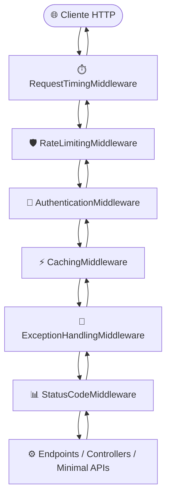

# ADR 001: Arquitetura, Convenções e Pipeline HTTP da TL.MiddlewareLibrary

## 🎯 Contexto e Desafio Prático

Ao construir Web APIs e microsserviços em ASP.NET Core corporativos, é comum ver times repetindo o mesmo código defensivo em diversos projetos:
- Controllers e endpoints Minimal APIs cheios de blocos `try/catch` manuais.
- Cada endpoint retornando erros em formatos diferentes (`{ erro }`, `{ message }`, `{ error_description }`), dificultando a vida de quem consome no front-end ou mobile.
- Falhas 500 vazando stack traces ou detalhes técnicos de banco de dados para clientes externos.
- Falta de controle simples de requisições por IP, facilitando sobrecargas acidentais.
- Dificuldade para medir o tempo real de resposta da aplicação de ponta a ponta.

A **TL.MiddlewareLibrary** foi projetada para resolver essas dores direto no pipeline do ASP.NET Core, de forma leve, fluente e sem obrigar o desenvolvedor a instalar dezenas de dependências externas pesadas.

---

## 💡 Decisões Arquiteturais Consolidadas

### 1. Pipeline HTTP Unificado e Ordem Canônica de Execução
Para garantir que cada middleware execute sua responsabilidade no momento exato do ciclo de vida da requisição (ida e volta), definimos a ordem canônica a seguir:

1. **`RequestTimingMiddleware` na ponta exterior:** Mede a duração completa do ciclo de vida, incluindo o tempo gasto em todos os outros middlewares e na action.
2. **`RateLimitingMiddleware` logo no início:** Bloqueia requisições excessivas antes de qualquer processamento mais pesado (autenticação ou banco).
3. **`AuthenticationMiddleware` antecipado:** Garante validação rápida de credenciais.
4. **`CachingMiddleware` antes do processamento:** Entrega respostas em cache imediatamente, poupando CPU e banco de dados.
5. **`ExceptionHandlingMiddleware` e `StatusCodeMiddleware` próximos à aplicação:** Interceptam exceções de domínio e erros de status, transformando-os em respostas claras e estruturadas.

---

### 2. Medição de Latência com Zero Alocação (`RequestTimingMiddleware`)
- Utiliza `Stopwatch.GetTimestamp()` e `Stopwatch.GetElapsedTime()` nativos do .NET para medir o tempo decorrido com precisão de nanossegundos e **zero alocação de objetos na Heap**.
- O tempo total é injetado no cabeçalho de resposta HTTP `X-Response-Time-Ms` através do evento assíncrono `context.Response.OnStarting()`, garantindo que o cliente receba a medição antes que os bytes do corpo comecem a trafegar.

---

### 3. Proteção contra Sobrecarga por IP sem Vazamento de Memória (`RateLimitingMiddleware`)
- Controla a taxa máxima de chamadas por cliente em uma janela de tempo configurável (ex: 100 requisições por minuto).
- **Tratamento defensivo de IP:** Trata cenários onde `context.Connection.RemoteIpAddress` pode vir nulo (comum em testes unitários ou proxies reversos), usando fallback seguro para o cabeçalho `X-Forwarded-For`.
- **Limpeza de recursos:** Implementa `IDisposable` para liberar o `System.Threading.Timer` de limpeza periódica de registros antigos, eliminando riscos de memory leak em aplicações com alto tempo de atividade (uptime).
- Quando o limite é estourado, responde imediatamente com status HTTP `429 (Too Many Requests)` e mensagem clara.

---

### 4. Cache em Memória Inteligente e Seguro (`CachingMiddleware`)
- Armazena em cache exclusivamente requisições seguras e idempotentes (`GET` e `HEAD`) que tenham retornado sucesso (`200 OK`).
- **Chave de cache composta:** A chave considera método, rota e os parâmetros da QueryString (`{Method}:{Path}{QueryString}`), evitando que filtros diferentes recebam os mesmos dados.
- **Buffering seguro de stream:** Intercepta temporariamente o fluxo do corpo da resposta com `MemoryStream`, garantindo que o stream original seja restaurado e entregue intacto ao consumidor.

---

### 5. Respostas de Erro Amigáveis e Padronizadas (`ExceptionHandlingMiddleware`)
- Elimina a necessidade de colocar `try/catch` defensivo em cada endpoint da aplicação.
- Quando uma exceção não esperada ocorre, o middleware intercepta, registra a falha com stack trace completo no `ILogger` interno e devolve para o cliente uma resposta limpa em formato JSON padronizado (`ProblemDetails`):
  - Inclui `traceId` (vinculado ao `HttpContext.TraceIdentifier`) para que o suporte ou o cliente possam rastrear o problema exato nos logs.
  - Oculta detalhes técnicos internos e stack traces sensíveis em erros 500, protegendo a segurança da aplicação.

---

### 6. Mapeamento de Exceções de Domínio e Fim do `async void` (`StatusCodeMiddleware`)
- **Tolerância Zero a `async void`:** Todas as chamadas assíncronas do pipeline operam estritamente retornando `Task` e utilizando `await`. Métodos `async void` foram banidos por quebrarem o ciclo de vida do ASP.NET e causarem crash de processo.
- **Respeito a respostas vazias (204 No Content):** Garante que requisições que retornam status 204 jamais recebam corpo de mensagem.
- **Catálogo de 12 Exceções Tipadas:** Permite que serviços de negócio lancem exceções expressivas (como `NotFoundException`, `BadRequestException`, `ConflictException`), sendo automaticamente convertidas para o status HTTP correspondente com mensagem amigável.

---

### 7. Multi-Targeting Moderno e Sem Complexidade (`net6.0;net8.0;net9.0`)
- Por ser uma biblioteca de pipeline que depende do ecossistema ASP.NET Core (`Microsoft.AspNetCore.App`), o projeto utiliza `<FrameworkReference Include="Microsoft.AspNetCore.App" />`.
- Oferece suporte oficial e sem avisos de compilação para **.NET 6.0 (LTS)**, **.NET 8.0 (LTS)** e **.NET 9.0 (Standard)**, garantindo que projetos legados e aplicações modernas desfrutem das mesmas otimizações.

---

## ⚖️ Consequências e Trade-offs

### Ganhos Práticos (Vantagens):
- **Produtividade Imediata:** Menos código repetitivo e boilerplate em controllers e serviços.
- **Experiência do Consumidor:** Respostas de erro consistentes e previsíveis para front-ends e clientes de API.
- **Segurança Operacional:** Diagnóstico rápido via `traceId`, proteção contra sobrecarga por IP e zero vazamento de exceções cruas.
- **Zero Dependências Pesadas:** Toda a suíte roda sobre o runtime nativo do ASP.NET Core.

### Trade-offs Assumidos:
- **Rate Limit Local:** O controle de taxa e cache ocorrem na memória da instância local da aplicação. Para arquiteturas distribuídas de altíssima escala com múltiplos nós, pode ser combinado no futuro com gateways ou Redis.

