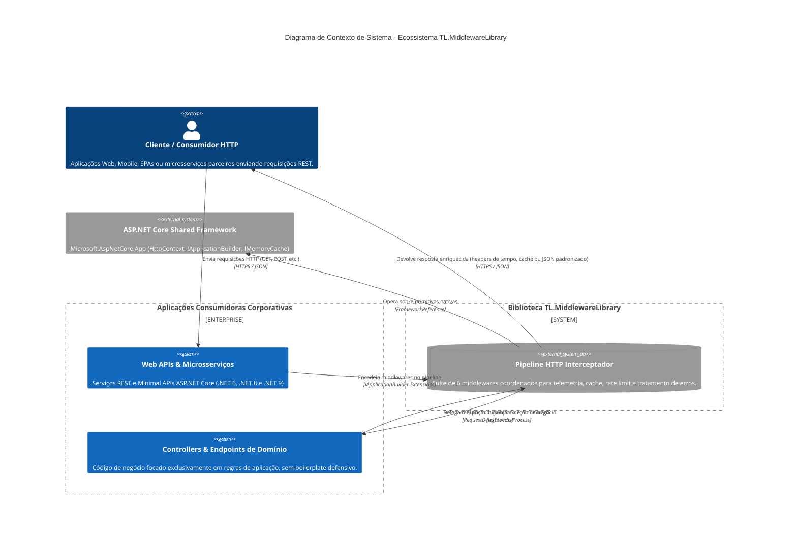
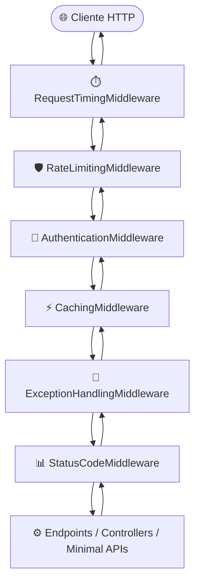

# 🏛️ Visão Geral da Arquitetura: TL.MiddlewareLibrary (MiddlewareLibrary)

## 📌 1. Propósito e Filosofia do Ecossistema

O **TL.MiddlewareLibrary** (solução `MiddlewareLibrary.sln`) é uma biblioteca modular de middlewares em C# / .NET desenvolvida com o objetivo de enriquecer, diagnosticar, proteger e padronizar o pipeline HTTP de aplicações corporativas em ASP.NET Core (.NET 6, .NET 8 e .NET 9).

### Princípios Norteadores:
1. **Baixo Acoplamento e Alta Coesão:** Cada middleware atua de forma independente e especializada no pipeline (medição de latência, limitação de taxa, autenticação, cache, tratamento de erros e tradução semântica de status), permitindo que a aplicação consuma apenas os componentes necessários.
2. **Pureza Assíncrona e Previsibilidade:** O pipeline opera exclusivamente sobre chamadas assíncronas determinísticas com `Task` / `ValueTask` e `await`, com eliminação completa de `async void` e chamadas síncronas bloqueantes (`.Result` ou `.Wait()`).
3. **Multi-Targeting Moderno:** Suporte nativo e otimizado para **.NET 6.0 (LTS)**, **.NET 8.0 (LTS)** e **.NET 9.0 (Standard)**, garantindo compatibilidade direta com aplicações corporativas estáveis e com o estado da arte do ecossistema .NET.
4. **Proteção de Invariantes (Fail-Fast & Zero-Allocation):** Validação imediata de argumentos e cabeçalhos, isolamento seguro de streams de resposta (`MemoryStream`) e uso de APIs de alta performance como `Stopwatch.GetElapsedTime()` para minimizar o impacto na latência e na memória.

---

## 🗺️ 2. Diagramas de Arquitetura C4

### 2.1. Nível 1: Diagrama de Contexto de Sistema (C4 Context)

O diagrama abaixo ilustra como as aplicações corporativas e microsserviços integram a biblioteca **TL.MiddlewareLibrary** em seus pipelines HTTP para atender requisições de clientes externos:

---

### 2.2. Nível 2: Diagrama de Componentes do Pipeline HTTP (C4 Component)

O diagrama a seguir detalha a **ordem canônica de execução dos 6 middlewares** no ciclo de vida da requisição (fluxo de ida e volta):

---

## 📦 3. Catálogo de Middlewares e Matriz de Multi-Targeting

> 💡 **Decisões de Arquitetura:** O design detalhado, trade-offs e invariantes de todos os middlewares abaixo estão centralizados na **[ADR-001: Arquitetura, Convenções e Pipeline HTTP](../adr/ADR-001-arquitetura-e-convencoes.md)**.

| Componente / Middleware | Runtimes Alvo (`TargetFrameworks`) | Dependências Externas | Responsabilidade Principal | Tópico na ADR |
| :--- | :---: | :---: | :--- | :---: |
| **`RequestTimingMiddleware`** | `net6.0;net8.0;net9.0` | **Zero (Framework Nativo)** | Medição precisa de latência via `OnStarting` com `Stopwatch.GetElapsedTime` e injeção do header `X-Response-Time-Ms`. | [§ 2](../adr/ADR-001-arquitetura-e-convencoes.md#2-medição-de-latência-com-zero-alocação-requesttimingmiddleware) |
| **`RateLimitingMiddleware`** | `net6.0;net8.0;net9.0` | **Zero (Framework Nativo)** | Limitação de requisições por IP cliente, controle thread-safe e descarte seguro de timers via `IDisposable` com resposta 429. | [§ 3](../adr/ADR-001-arquitetura-e-convencoes.md#3-proteção-contra-sobrecarga-por-ip-sem-vazamento-de-memória-ratelimitingmiddleware) |
| **`AuthenticationMiddleware`** | `net6.0;net8.0;net9.0` | **Zero (Framework Nativo)** | Validação prévia de credenciais no cabeçalho `Authorization`, interrompendo o pipeline precocemente caso inválido (401/403). | [§ 1](../adr/ADR-001-arquitetura-e-convencoes.md#1-pipeline-http-unificado-e-ordem-canônica-de-execução) |
| **`CachingMiddleware`** | `net6.0;net8.0;net9.0` | `Microsoft.Extensions.Caching.Memory` | Cache em memória para consultas `GET` e `HEAD` com status 200 OK, isolamento estrito por rota e QueryString e buffering seguro. | [§ 4](../adr/ADR-001-arquitetura-e-convencoes.md#4-cache-em-memória-inteligente-e-seguro-cachingmiddleware) |
| **`ExceptionHandlingMiddleware`** | `net6.0;net8.0;net9.0` | **Zero (Framework Nativo)** | Captura de exceções não tratadas, mascaramento seguro em erros 500, injeção de `traceId` e logging estruturado com stack trace. | [§ 5](../adr/ADR-001-arquitetura-e-convencoes.md#5-respostas-de-erro-amigáveis-e-padronizadas-exceptionhandlingmiddleware) |
| **`StatusCodeMiddleware`** | `net6.0;net8.0;net9.0` | **Zero (Framework Nativo)** | Mapeamento automático de 12 exceções de negócio para status HTTP e garantia de que respostas 204 No Content fiquem sem corpo. | [§ 6](../adr/ADR-001-arquitetura-e-convencoes.md#6-mapeamento-de-exceções-de-domínio-e-fim-do-async-void-statuscodemiddleware) |

---

## ⚙️ 4. Diretrizes de Engenharia e Boas Práticas

1. **Pureza Assíncrona e Fim do `async void`:** Todo método assíncrono deve retornar obrigatoriamente `Task` ou `ValueTask` e utilizar `await`. É estritamente proibido `async void` ou chamadas bloqueantes (`.Result`, `.Wait()`), que esgotam o ThreadPool do ASP.NET.
2. **Eliminação de Falhas Silenciosas e Logging Estruturado:** Proibição estrita de blocos `catch` vazios. Exceções interceptadas devem registrar contexto estruturado com `ILogger.LogError`, preservando a instância original da exceção para rastreamento.
3. **Modernização com Zero-Allocation:** Otimizações contínuas de memória, como o uso de `Stopwatch.GetElapsedTime()` em vez de instanciar novos objetos `Stopwatch`, reduzindo a pressão sobre o Garbage Collector em picos de tráfego.
4. **Proteção contra Memory Leaks & Gestão de Recursos:** Middlewares que utilizam recursos descartáveis (como `System.Threading.Timer` no rate limiting) devem implementar `IDisposable` e garantir liberação segura no encerramento da aplicação.

